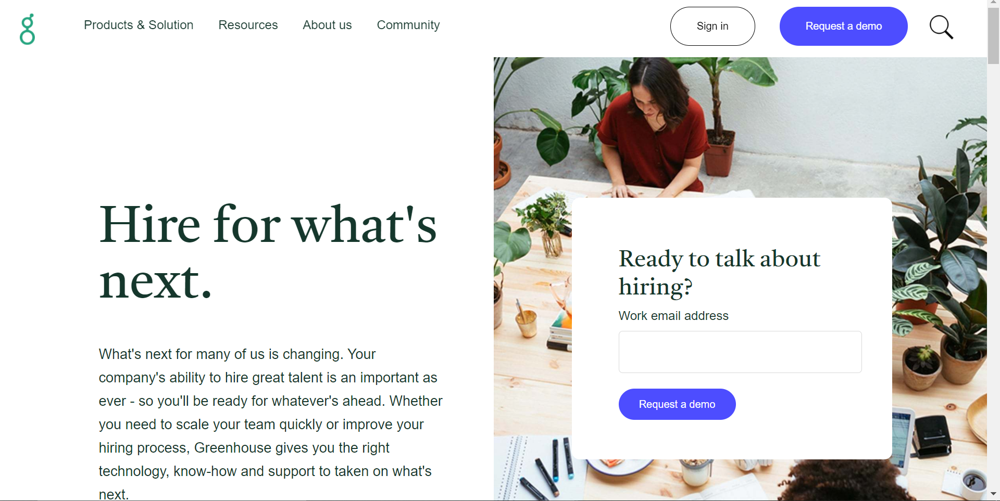
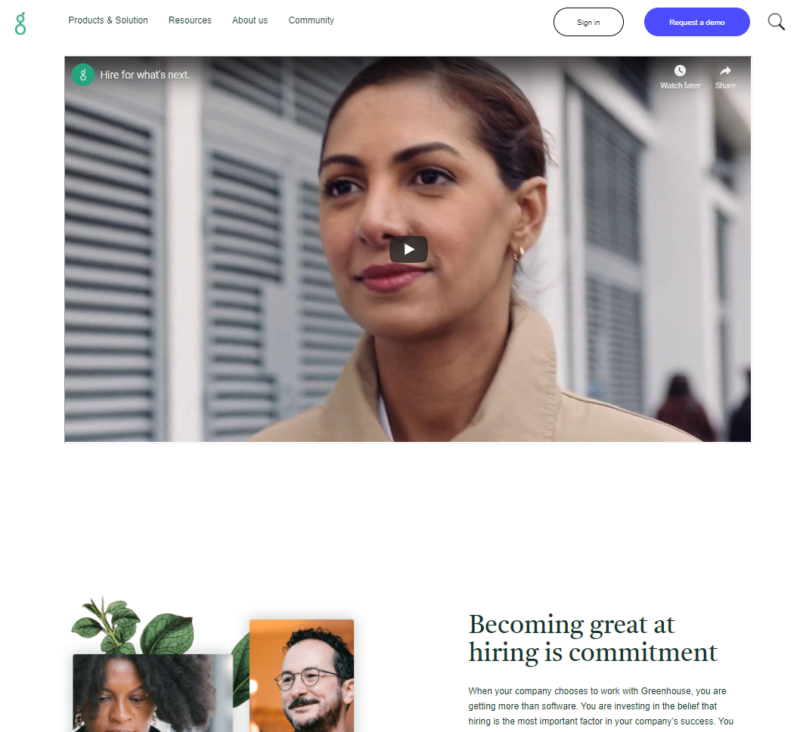
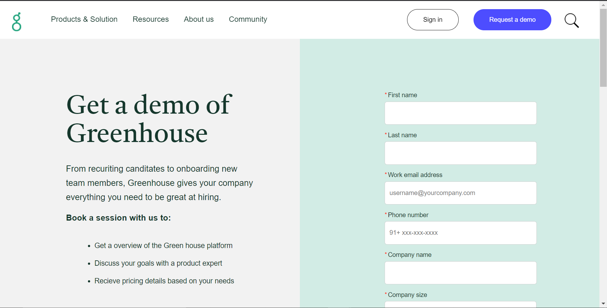

# Greenhouse Clone

## Problem statement
To make the pixel perfect clone (front-end) of the site [greenhouse.io](https://www.greenhouse.io/) by using only the technologies covered in the Unit 1 with a time span of 3 days.

## Team members
1) Shashank Sinha,
2) Smith Rakesh,
3) Saravanakumar J N.

## Tech Stack
1) HTML,
2) CSS,
3) JS DOM (Basic JavaScript).

## About Greenhouse
Greenhouse is a service provider who provides software for enabling an effective and a smoother Hirindg process.

## Screen Samples of the UI cloned by our team

