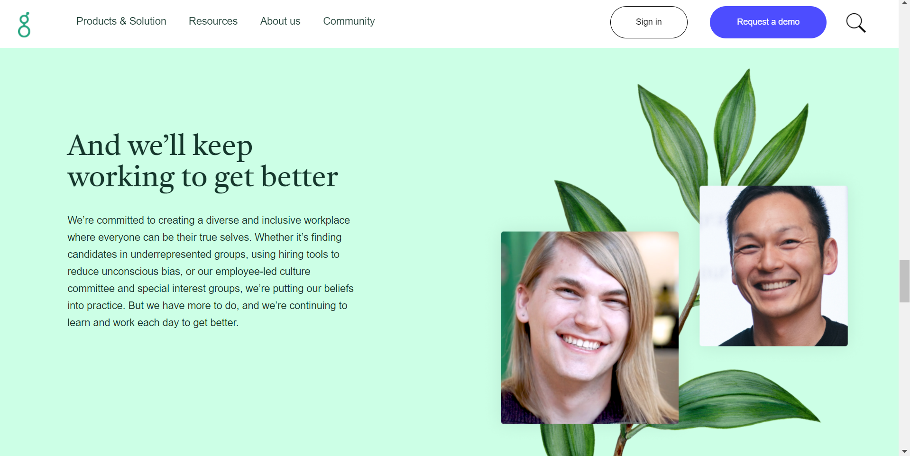

# Greenhouse Clone

## Problem statement
To make the pixel perfect clone (front-end) of the site [greenhouse.io](https://www.greenhouse.io/) by using only the technologies covered in the Unit 1 with a time span of 3 days.

## Team members
* Shashank Sinha,
* Smith Rakesh,
* Saravanakumar J N.

## Tech Stack
* HTML,
* CSS,
* JS DOM (Basic JavaScript).

## About Greenhouse
Greenhouse is a service provider who provides software for enabling an effective and a smoother Hirindg process.

## Screenshots of our work

\
\
\
\

\
\
\
\

\
\
\
\

